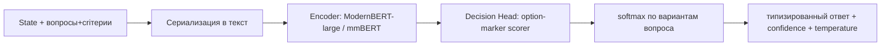

<!-- _class: lead -->

# Jev и Laya

## Как устроены «System One» decision-модели
### и как этот подход реализован в открытой модели Laya

<br>

Контекст проекта: классификация поведения по временным рядам мощности
(«клоны Jev» vs baseline-модели) + адаптер TypeSafe System One поверх GigaChat

---

# Проблема: LLM — «chat», а не надёжное ПО

- **RLHF** сделал LLM супер-человечными в следовании инструкциям, но породил:
  - **mode dropping** — вырождение разнообразия ответов,
  - **overconfidence** — уверенность без истинной вероятности,
  - **отсутствие надёжности** → нужен человек в цикле (human-in-the-loop).

- LLM возвращают **строки текста** — их нужно парсить, валидировать, перезапрашивать.

- **Стоимость** одного решения на сильном LLM — дорогая генерация токенов
  (до 8+ секунд и ¥0.014 за типовую задачу).

```
LLM:  "please structure": "billing"   ← нужно распарсить, проверить, повторить при ошибке
Jev:  {"choice": "billing", "confidence": 0.94}   ← тип, значение, уверенность сразу
```

---

# Обратный путь: «машине нужны решения, а не разговор»

TypeSafe AI сознательно пошла **в противоположном направлении**:

- Не «chat», а **System One Models** — модели, созданные **для машин**:
  - новая архитектура,
  - новый сэмплер,
  - новый алгоритм обучения — **RLCD** (Reinforcement Learning for Calibrated Decisions).

- Принцип: **едниственная задача модели — принимать решения**, генерируя 0 токенов текста.

```
192.6× быстрее, 444.6× дешевле чем LLM на workflow-задачах System One
```

(данные: блог TypeSafe AI «Introducing System One Models & Jev»)

---

# Jev — первый публичный System One model (TypeSafe AI)

**Что это:** модель, которая на вход получает **состояние** (текст, документ, JSON…)
и **типизированные вопросы**, а на выходе даёт типизированные ответы с вероятностями.

- **Jev истоки — исследование Novo Nordisk** (авторы: Sune Debel, Ewa Andrejczuk и др.);
  проект выделился в компанию **TypeSafe AI** (SF).
- Доступен через **закрытый API** (docs.typesafe.ai, console.typesafe.ai), хотя
  есть открытая спецификация протокола и open-реплики.
- **Стоимость**: $42 / 1 млрд токенов — в 238× дешевле Claude Fable 5.1.
- Каждое решение = **choice / score / noul** + **calibrated confidence**.

Формально:
```text
POST /v1/systemone  { state, questions: { qid: {type, instructions, criteria} } }
        ↓
        { qid: { choice|score|noul, probabilities[], confidence, ... } }
```

---

# Типизированные решения (Typed Decisions)

Интерфейс **не зависит от модели/backend** — программа оперирует типизированными значениями:

| Тип | Смысл | Формат ответа |
|---|---|---|
| **choice** | выбор одного варианта из N | `choice` + `probabilities[]` |
| **score** | числовая оценка по критериям | `score` + доверие |
| **noul** | бинарный «да/нет» (no / unknown / yes) | `noul` = P(да) + `confidence` |

- **Confidence** — оценка уверенности модели → программа сама решает:
  *высокая уверенность = действовать автономно*, низкая = эскалация человеку.
- Пороги уверенности подбирает разработчик — «intelligence used with control».

```python
questions = {
  "department": {"type": "choice", "criteria": {"billing": "...", "technical": "...", "other": "..."}},
  "urgency":    {"type": "score",  "criteria": ["not urgent", "soon", "blocking"]},
  "churn_risk": {"type": "noul",   "instructions": "Пользователь грозит уйти?"},
}
ans = system_one(state, questions)
print(ans["department"]["choice"], ans["churn_risk"]["noul"], ans["department"]["confidence"])
```

---

# Как учим: RLCD — правдивые вероятности как оптимум

**RLCD = Reinforcement Learning for Calibrated Decisions.**

- Модель выдаёт распределение. **Exploration** — гауссовский шум на логитах.
- **Reward = строго собственный scoring rule**
  (log + spherical; для порядковых — ranked probability score).
- Строго собственная мера ⇒ **максимизировать reward можно ТОЛЬКО честными вероятностями**.
- Обновления: REINFORCE с градиентной базой по группе (GRPO-style).
- Многоходовые диалоги: TD(λ=1.0) по префиксным срезам.

> Следствие: модель не штрафуется за «уверенность», а штрафуется за **некалиброванность** —
> report honest probabilities — это единственный способ максимизировать награду.

Сталь, которую наследует и Laya: логика RLCD.

---

# Архитектура системы (как это устроено изнутри)

Упрощённая схема «одного прохода» (принципы Jev, реализация Laya):



- **Option markers**: каждый вариант получает свой `[MASK]`-токен,
  моделируется **scorer** по скрытому состоянию маркера,
  затем **softmax по вариантам вопроса**.
- **Пространство ответов задаётся на лету** (каждым запросом) —
  новая схема вопросов **не требует дообучения**.
- **Весь пакет вопросов — за один forward pass** (batching).

---

# Laya — открытая реализация подхода Jev

**Что это:** многоязычная, **не-авторегрессионная** System One decision-модель (Apache-2.0).

- GitHub: `github.com/NandhaKishorM/laya` · HF: `convaiinnovations/laya`
- Установка: `pip install laya`
- Ничего не «генерирует» → **нечего парсить, нечему галлюцинировать**.

```python
from laya import Router
router = Router()  # скачает чекпойнт при первом вызове
res = router.predict(state, questions)
print(res["answers"]["department"]["choice"])   # billing
print(res["answers"]["churn_risk"]["noul"])     # 0.892
print(res["routing"]["model"], res["answers"]["department"]["confidence"])  # english, 0.94
```

Аналогичный API — у GigaChat-адаптера в нашем проекте (Noul/Score/Choice +
`SystemOneResponse` + corrective-retries).

---

# Архитектура Laya — 1:1 наследование идей Jev

| Компонент | Реализация в Laya |
|---|---|
| Backbone | **ModernBERT-large** (bi-directional, 395M) + головы, итого **421M**; multilingual: mmBERT-base, 322M |
| Decision head | 2 Transformer-слоя + **option-marker scorer** + **act/escalate head** |
| Кодирование вопросов | state + instructions + criteria → текст со `[MASK]`-маркерами вариантов |
| Score | у каждого `[MASK]`-токена своё значение → softmax по вариантам вопроса |
| Типизация | **choice / score / noul** (тот же протокол, что Jev API) |
| Budget | 512 токенов/вопрос (EN, head_max_len=192); 1024 (multilingual, 256) |
| Batching | все вопросы вызова — **один forward pass** (~33 ms на GPU) |

Код обучения головы (упрощённо): `TransformerEncoder → scorer(LayerNorm→Linear→GELU→Linear(d,1))`.

---

# Калибровка и confidence в Laya

- **Raw ECE** базовой модели перекалиброван: после **temperature-fitting** по типам
  (question type, option count) ECE падает: **0.466 → 0.081** (EN), **0.314 → 0.106** (multilingual).
- Confidence «работает»: на проверочных данных AUROC = 0.77.
- **act_probability пока не несёт сигнала** (≈1.0 почти всегда) → в проде
  gate-ите по `confidence`, а не по `act`.

Вывод для нашего проекта (fine-tune Laya, frankentein-подход):
- подгонка temperature на своих данных — обязательный шаг до доверия вероятностям;
- baseline-модели (base English) почти **на уровне random** на typed-decisions
  (0.362 vs random 0.318) — эффект достигается **fine-tuning'ом**, поэтому в
  эксперименте закладываем разделы 4 (fine-tune) и 5 (fine-tune слоёв).

---

# Router: многоязычность и маршрутизация

**Router** — recommended way в проде:

- определяет **script / язык** (< 0.5 ms, чистый Python, ДО forward pass),
- направляет на оптимальный чекпойнт (english / multilingual / typed-decisions),
- строки-реплики: `routing.model`, `routing.reason`.

```python
res_hi = router.predict({"body": "मुझसे दो बार शुल्क लिया गया, कृपया पैसे वápать करें।"}, questions)
print(res_hi["answers"]["department"]["choice"], res_hi["routing"]["model"])
# billing multilingual
```

Почему это важно (доказано vs Jev bench):
- English-чекпойнт на кхмерском: **acc 0.000 при confidence 0.952** —
  модель уверенно и системно неверна → confidence-gating не спасёт.
- Routing охватывает **45/51 языков** (>3× random) против 23/51 у EN ровера.

Сравнение в бенчмарке (T4 GPU):

```
MASSIVE intent EN:       laya 0.783 vs multilingual 0.657 vs Router 0.783
MASSIVE intent 13+ langs: laya 0.306 vs multilingual 0.451 vs Router 0.451
Latency 1 q (T4):        39.5 ms vs 32.8 ms
Latency 10 q batched:    158.6 ms vs 72.3 ms
```

---

# Jev-совместимый сервер (self-hosting)

`laya-serve` реализует **тот же протокол, что TypeSafe Jev** —
`POST /v1/systemone`, те же shape-ы вопросов и ответов.

```bash
pip install "laya[serve]"
LAYA_DEVICE=cuda LAYA_PRELOAD=1 laya-serve        # 0.0.0.0:8000
curl -s localhost:8000/v1/systemone -d '{ "state": {"document": "..."},
  "questions": {"billing": {"type": "noul", "instructions": "..."}} }'
```

- принимает любые формы вопросов Jev API (в т.ч. `criteria` как список),
- 422 с именем поля при malformed-вопросе,
- `Authorization: Bearer <key>` при `LAYA_API_KEY`.

> Значит, клиенты TypeSafe могут переключиться на Laya сменой base URL —
> экосистема остаётся совместимой на уровне протокола.

---

# Обучение Laya на практике (fine-tuning)

Официальный пайплайн на Kaggle (2×T4, готовый ноутбук в репо) — RLCD из «первых рук»:

1. **Собрать датасет**: штат + вопросы + ответы учителя (choice/score/noul) с вероятностями.
2. **Forward**: энкодер + decision head → логиты вариантов.
3. **Reward (strictly proper)**: log + spherical (+RPS для ordinal).
4. **Policy gradient**: REINFORCE + group-mean baseline (GRPO-стиль); exploration — шум на логитах.
5. **Post-training**: подгонка temperature на валидации → калибровка.
6. **Evaluate & push** на Hub (например, `laya-typed-decisions`).

Результат fine-tune:
```
typed-decisions (2k decisions, 4 workflows):  0.362 → 0.766 (vs Jev 0.727)
по примитивам: noul 0.857, choice 0.733, score 0.723
```
Наш эксперимент: follow-up — fine-tune Laya на задачах классификации
поведения по P_RMS (разделы 4–5 ноутбука) вместо генеративного GigaChat.

---

# Laya vs Jev: ключевой бенчмарк (типизированные решения)

Из опубликованных бенчмарков (Jev-цифры третьих лиц, Laya измерена автором):

| Метрика | TypeSafe Jev 1.13.0 | Laya (routed) |
|---|---|---|
| typed-decisions acc (2k) | 0.727 | **0.766** |
| AG News (4 labels) | 0.910 | **0.950** |
| Banking77 (>20 options) | **0.870** | 0.425 |
| ECE (ниже=лучше) | 0.246 | **0.081** |
| p50 latency, 1 вопрос | 236–276 ms | **32.8 ms** |
| Языки (>3× random) | нет данных | **45 из 51** |
| Веса | закрытый API | **Apache 2.0** |
| Стоимость | $0.042 / 1M токенов | **$0 (self-hosting)** |

Где Jev сильнее: **50+ вариантов в одном вопросе** (общий бюджет head=192–256 токенов
не хватает на каждый маркер), и **soft-distribution matching** (0.580 vs 0.471).

---

# Честные ограничения Laya (наши уроки)

- **Base-модели ≈ random** на специализированных задачах (0.362 vs 0.318) —
  нужен fine-tune; Laya — «быстрая база для специализации», не zero-shot-движок.
- **High-cardinality выборы** (>50 опций) деградируют: каждый маркер получает ~3-4 токена.
  Лечение: поднять `head_max_len` / `max_len`, или коарс-а-файн (2 уровня).
- **noul** может «залипнуть» на своих label'ах (`false:` / `true:`), игнорируя state.
- **score** — слабейший примитив (SST-5 0.372).
- **Сырые вероятности over-confident** — temperature обязательно перекалибровать.

Наш вывод для эксперимента: не полагаться на confidence без калибровки на
собственных данных; сравнивать acc и macro-F1 на едином test-сплите.

---

# Резюме

| | Jev (TypeSafe AI) | Laya (open source) |
|---|---|---|
| Тип | System One, закрытый API | System One, Apache-2.0 |
| Идея | typed decisions + calibrated confidence, 0 токенов | 1:1 то же |
| Модель | проприетарная | ModernBERT-large 421M / mmBERT 322M |
| Обучение | RLCD | RTCD-в-духе (GRPO, strictly proper rules) |
| Протокол | `/v1/systemone` | **совместим** |
| Доступ | $$ | **бесплатно, self-host** |

**Главное:** сначала «голова» type-safe решений и правдивой уверенности,
потом — быстрый inference одним forward pass-ом и открытая реализация.

**Наш проект:** используем Laya как «клон Jev» для классификации поведения —
zero-shot (раздел 2), RandomForest baseline (раздел 3), fine-tune Laya (раздел 4),
«Франкенштейн» TimesFM→Laya (раздел 5) и сравнение на чешском тест-сплите.

---

<!-- _class: lead -->

# Спасибо!

<br>

**Ссылки:**
- TypeSafe AI — https://www.typesafe.ai/ · блог «Introducing System One Models & Jev»
- Laya — https://github.com/NandhaKishorM/laya · https://huggingface.co/convaiinnovations/laya
- Fine-tune ноутбук — `notebooks/laya_finetune_typed_decisions_2xT4_kaggle.ipynb`
- Наш эксперимент — `Jev_Laya_smartplug.ipynb` (этот репозиторий)