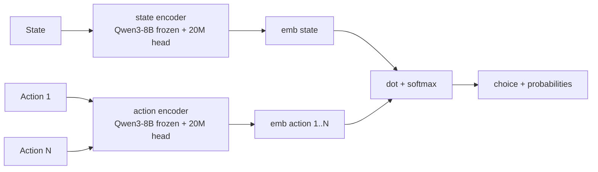
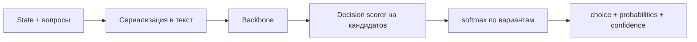
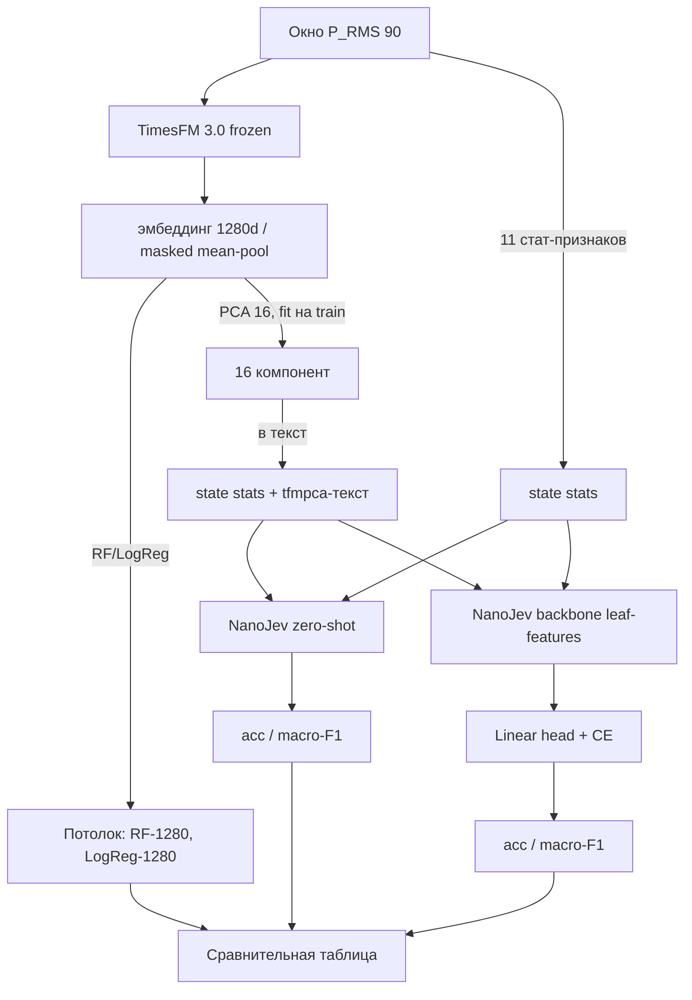

<!-- _class: lead -->

# System One-модели

## CLM-8B · Jev · эксперимент TimesFM → NanoJev

<br>

- **CLM-8B** — открытая контрастивная модель «скоринга действий» (Apache-2.0);
- **Jev** — первый публичный System One model (TypeSafe AI);
- наш эксперимент: переносим их идеи на классификацию поведения по `P_RMS`.

---

# С чего всё началось: LLM — «chat», а не надёжное ПО

- **RLHF** дал супер-человечность в следовании инструкциям, но породил:
  - **mode dropping** (вырождение разнообразия),
  - **overconfidence** (уверенность без вероятности),
  - **ненадёжность** → человек в цикле (human-in-the-loop).

- LLM возвращают **строки текста** — их парсят, валидируют, перезапрашивают.
- Решения **медленные и дорогие**: 3–329 с и платные выходные токены.

```
LLM:  "please structure": "billing"    ← парсить, проверять, повторять
Jev:  {"choice": "billing", "confidence": 0.94}    ← тип + вероятность сразу
CLM:  {"choice": "billing", "probabilities": {...}}  ← скоринг кандидатов
```

> Выход: класс **System One Models** — «машине нужны решения, а не разговор».

---

# Две открытые ветки «System One»

| | **Jev** (TypeSafe AI) | **CLM-8B** (Contrastive-LM) |
|---|---|---|
| Идея | типизированные решения + калиброванная уверенность | контрастивный скоринг state ↔ action |
| Вывод | все вероятности параллельно, 0 токенов | 1 эмбеддинг состояния + dot-product |
| Обучение | RLCD | InfoNCE (3-этапный рецепт) |
| Протокол | `/v1/systemone` | `/v1/systemone` (**совместим**) |
| Открытость | закрытый API (early access с 15.09.2026) | **Apache-2.0** (голова 75 МБ) |
| Опора на GPU | проприетарная | Qwen3-8B энкодер (≥16 ГБ) |

Общая теорема: «state в, типизированное решение из — без генерации токенов».

---

# Часть 1 · CLM — контрастивные языковые модели

## Архитектура: не генерировать, а ранжировать кандидатов

- **Два энкодера**: state-энкодер и action-энкодер.
- Каждый = **замороженный Qwen3-8B** + обучаемая проекционная голова **~20M параметров**;
  чекпойнт-«голова» весит всего **75 МБ** (Apache-2.0).
- Скоринг: `score_i = dot(state_emb, action_emb_i)`; `softmax` по кандидатам = распределение ответа.



- Типизированный вопрос = **state + закрытый набор кандидатов** (опции с описаниями).

---

# Как учат CLM: двунаправленный InfoNCE + 3-этапный рецепт

**Цель**: подтянуть state к сэмплированному действию, оттолкнуть от остальных.

```
L = -1/(2B) Σ [ log exp(sᵢᵀaᵢ/τ) / Σⱼ exp(sᵢᵀaⱼ/τ)
               + log exp(aᵢᵀsᵢ/τ) / Σⱼ exp(aᵢᵀsⱼ/τ) ]
```

| Этап | Данные | Эффект |
|---|---|---|
| 1. Pre-training | ~60M Nemotron DQA (вопрос = state, ответ = action) | широкие семантические представления |
| 2. Mid-training | ~30M синтетических **hard negatives** (Gemini 2.5 Flash-Lite) | различение похожих вариантов |
| 3. Post-training | ~1M агентских траекторий (ADP, Endless-Terminals, LiteCoder) | agentic alignment (40% replay) |

Ключевой урок: hard negatives лучше работают как **доработка**, а не как старт —
52.1% → **69.2%** (двустадийно) против пиковых **62.4%** при обучении на них с нуля.

Scaling laws: `L(X) ≈ (X_c/X)^α` по compute/dataset/head/encoder; ~**310 токенов на параметр**
оптимального размера головы; рост энкодера даёт наибольший выигрыш.

---

# Чем CLM отличается от GPT

| | **GPT / LLM** | **CLM-8B** |
|---|---|---|
| Режим | **генеративный** | **дискриминативный** |
| Вывод | авторегрессия: токен за токеном | эмбеддинг state + dot по кандидатам |
| Пространство ответов | словарь (любой текст) | кандидаты, заданные запросом (2–255) |
| Скорость | 3–329 с (reasoning режимы дороже) | 16–80 мс (нулевик, RTX 4090) |
| Тип ошибок | галлюцинации, ошибки формата | **не может** ответить несуществующим вариантом |
| Интеграция в код | парсинг → валидация → повторы | тип + вероятность сразу |
| Данные-эффективность | генеральный интерфейс к людям | специализация на выборе/ранжировании |

> Плата за это: CLM **не придумает** ответ, которого нет в списке кандидатов,
> и зависит от качества этих кандидатов. LLM остаются универсальными.

---

# CLM-8B vs Jev: нулевик (zero-shot)

| Задача | CLM-8B латенси | Jev латенси | CLM-8B успех | Jev успех |
|---|---|---|---|---|
| **T-Rex game** | 16.5 мс | 149.8 мс | 5/5 | 5/5 |
| Tool calling (BFCL v4) | 76.8 мс | 125.5 мс | 95.2% | 99.2% |
| WikiRacing | 79.8 мс | 225 мс | 26/30 | 30/30 |
| Super Mario | 33.5 мс | 132.6 мс | 5/5 | 5/5 |

- **До 9× быстрее** Jev; с ~1 000 кандидатов — **13×** (эмбеддинги действий кэшируются).
- На играх — вровень; на tool calling и WikiRacing — чуть ниже по точности.
- **Verifier (fine-tuned heads, H100)**: DeepSWE **81.6%** (79 мс) vs Jev 71.1% (449 мс);
  Terminal-Bench 2.1 **87.6%** (32 мс) vs 83.1% (131 мс) — 4.1–5.7× быстрее. Хелд-аут-подмножества.

**Откуда скорость**: state и actions «развязаны», действие повторно используется между шагами,
векторы живут в зарезервированном кэше (как KV-cache у vLLM): повторные состояния 1.7 → **0.6 мс**.

> Но CLM-8B требует **Qwen3-8B** энкодер ⇒ ≥16 ГБ VRAM. На 4 ГБ — не помещается.

---

# Часть 2 · Jev: почему он так хорош в Doom и WikiRacing

## Jev — первый публичный System One model (TypeSafe AI)

- State (текст/документ/JSON) + типизированные вопросы → типизированные ответы с вероятностями.
- **RLCD** + **параллельный семплер**: все вероятности сразу, 0 сгенерированных токенов.
- 70–500 мс end-to-end (vs 3–329 с у frontier LLM); $0.042/MTok, выходные токены бесплатно.
- **Гарантированно** без типовых ошибок и без галлюцинаций (математически исключено).
- Типы: **choice / score / noul** + калиброванная уверенность.

```
state + questions → choice / score / noul + probabilities + confidence
```

Имя — в честь Уильяма Стэнли Джевона; идея «System One» — из «Thinking, Fast and Slow» (Канеман).

---

# Почему Jev хорош в Doom

Демо TypeSafe: живой бот, который реагирует на игровой процесс в реальном времени.

- **10 решений в секунду** (~$7/час) — реально для real-time, где LLM-циклы в 100× медленнее.
- Вход — **структурированный state** (дата-структура + текст), пока без изображений;
  реактивность к *разным представлениям* игрового состояния.
- **Параллельность**: все действия оцениваются одним вызовом — нет последовательной генерации токенов.
- **Нет галлюцинаций**: Jev не «выдумывает» несуществующие действия — выбор всегда валиден.
- **Следует инструкциям**: правила поверх изменяющегося state.

> Нюанс авторов: не-AI бот сыграл бы лучше; но суть —
> «интеллект-в-секунду» + реактивность к state + следование инструкциям.

---

# Почему Jev хорош в WikiRacing

Задача: из стартовой страницы Википедии дойти до целевой, переходя по ссылкам.
Каждый шаг — выбор из **сотен–тысяч ссылок**.

- **Высокая мощность выбора**: Jev оценивает все ссылки **за один вызов** (кардинальность до 255;
  для больших наборов — двухэтапная схема «скоринг → явный выбор»).
- **Не галлюцинирует при большом выборе**: каждый вариант — реальная ссылка.
- **Интеллект-в-секунду**: сочетание скорости (меньше латенси, чем у LLM-режимов reasoning)
  и точности (Jev чаще финишировал **за меньшее число шагов** ≈ признак большего интеллекта).
- «Складывающийся» эффект: на каждом шагу меньше ошибок → меньше возвратов → быстрее маршрут.

> Общее в Doom и WikiRacing: **закрытые наборы действий + быстрый параллельный скоринг
> + отсутствие генерации** — это именно то, чем CLM позднее усиленно «выигрывал» у Jev по латенси.

---

# Typed Decisions: протокол, независимый от бэкенда

| Тип | Смысл | Формат ответа |
|---|---|---|
| **choice** | выбор одного из N | `choice` + `probabilities[]` |
| **score** | число по рубрике | `score` + доверие |
| **noul** | бинарное «да/нет» | `noul` = P(да) + `confidence` |

- **Confidence** = доверие модели → программа сама выбирает:
  высокое = действовать автономно, низкое = эскалация человеку.
- Пороги уверенности задаёт разработчик — «intelligence used with control».

Этот протокол реализуют и Jev, и CLM, и открытые «клоны» (Laya, NanoJev).

---

# Как учится Jev: RLCD — правдивые вероятности как оптимум

**RLCD = Reinforcement Learning for Calibrated Decisions.**

- Модель выдаёт распределение; **exploration** — гауссовский шум на логитах.
- **Reward = строго собственный scoring rule** (log + spherical; для порядковых — RPS).
- Строгая собственность ⇒ максимизировать reward можно **только честными вероятностями**.
- Обновления: REINFORCE с GRPO-style базой; диалоги — TD(λ=1.0) по префиксным срезам.

> Модель штрафуется не за «уверенность», а за **некалиброванность**.

Сталь, наследуемая открытыми реализациями (Laya, NanoJev).

---

# Открытые реализации: Laya и NanoJev

| | **Laya** | **NanoJev** |
|---|---|---|
| Backbone | ModernBERT-large (бидир., 395M) + головы = 421M | Qwen3-0.6B |
| Decision head | option-marker scorer (`[MASK]` на кандидатов) | scorer на **последней позиции** каждого листа + attention set-head |
| Кодирование | state + вопросы → текст с маркерами | каждый кандидат — отдельный «лист»-префикс → backbone → скаляр |
| Требования | малые GPU, супер-быстро | **~1–2 ГБ** bf16/fp16 — влазит в 4 ГБ |
| Лицензия | Apache-2.0 | открытый чекпойнт (Apache-2.0) |

Общая схема (принципы Jev):



---

# Часть 3 · Наш эксперимент: TimesFM → NanoJev

## Задача: классификация поведения по энергопотреблению

- Данные: `P_RMS, mW` со смарт-розетки (CSV, `;`).
- Разбивка на окна по **90 отсчётов**; классы: `IdleCharge / MixedBrowsing / Browsing / VKAudio`.
- Стратифицированный сплит 30% на тест, `random_state=42` — **одинаков для всех подходов**.
- Это ровно «System One»-форма: **state = окно → вопрос «какой паттерн?» → choice**.

Как связано с CLM:
- **«Потолок»**: RF/LogReg прямо на эмбеддингах TimesFM = контрастивный скоринг в духе CLM
  (чем ближе вектор состояния к «вектору класса», тем выше вероятность).
- **NanoJev zero-shot** = «Jev-стиль»: типизированный вопрос по текстовому state.
- **«Франкенштейн»-голова** = обучаемый scorer поверх фич backbone`а (как у CLM: heads поверх энкодера).

---

# Pipeline эксперимента



- Проба на эмбеддингах = «потолок»; zero-shot и голова — как близко мы подбираемся к нему.
- Калибровка PCA только на train — без утечки; токенизаторный контракт проверен
  (`validate_request` из репо NanoJev).

---

# Что уже проверено / что нас ждёт

- **Контракт** чекпойнта `C-Tianyu/NanoJev`: `states[{id, state, questions}]`,
  типы `boolean / choice / score`, `max_length=8192`, `set_head="attention"`, bf16.
- **Токенизаторный бюэкзамен**: реальный Qwen3-токенизатор чекпойнта —
  листья укладываются в 8192 (stats ~306 / tfmpca ~468 токенов), границы пулинга корректны.
- **Утилизиция GPU**: на T4 форсим fp16 (bf16 на T4 медленный); батчи и прогресс-бары;
  кэш фичей на диск.

Ожидания (гипотезы, цифры после прогона):

| Подход | acc тест | комментарий |
|---|---|---|
| RF на 11 стат-признаках | — | базовый бейзлайн |
| RF / LogReg на эмбеддингах 1280d | — | **потолок** признаков TimesFM |
| NanoJev zero-shot (stats) | — | Jev-стайл по тексту |
| NanoJev zero-shot (stats + PCA16) | — | кузина CLM-скоринга через текст |
| NanoJev + Linear-голова (stats / tfmpca) | — | «heads поверх энкодера», как CLM |

Гипотеза: потолок выше; zero-shot ниже; голова подтягивает; «транспорт признаков через текст» — узкое место.

---

# Резюме

- **CLM** открыла дискриминативный путь: эмбеддинги + dot-product на кандидатах →
  до **9× быстрее** Jev, без генерации текста и без галлюцинаций, но с тяжёлым Qwen3-8B.
- **Jev** + RLCD: типизированные решения и **калиброванная уверенность** — именно они позволяют
  Doom-бота выдавать 10 решений/с и WikiRacing выбирать среди тысяч ссылок за один вызов.
- **Наша задача** повторяет ту же форму «state → choice»: NanoJev = открытый Jev-подобный базис,
  TimesFM-эмбеддинги = контрастивный «потолок», Linear-голова = обучаемый CLM-стиль scorer.

**Вопрос дальше**: стоит ли под H100 сделаться на полноценный CLM-8B (нужен ≥16 ГБ),
или остаёмся на NanoJev (0.6B, влезает в 4 ГБ) и развиваем «головы-скоры» на эмбеддингах.

---

<!-- _class: lead -->

# Спасибо!

<br>

**Ссылки:**
- CLM — https://github.com/Contrastive-LM/CLM · https://huggingface.co/Contrastive-LM/CLM-v0.1-8B
  · блог https://contrastive-lm.notion.site · пресс-релиз MarkTechPost (23.09.2026)
- Jev — https://www.typesafe.ai/ · блог «Introducing System One Models & Jev»
- Laya — https://github.com/NandhaKishorM/laya · https://huggingface.co/convaiinnovations/laya
- NanoJev — https://huggingface.co/C-Tianyu/NanoJev (revision `unified-games-v1`)
- Наши ноутбуки — `TimesFM_to_NanoJev_smartplug.ipynb`, `NanoJev_vs_RF_smartplug.ipynb`,
  `Jev_Laya_smartplug.ipynb` (этот репозиторий)